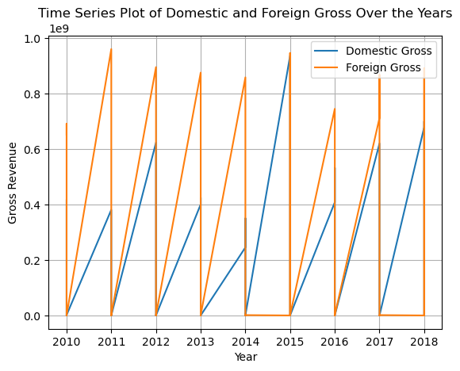
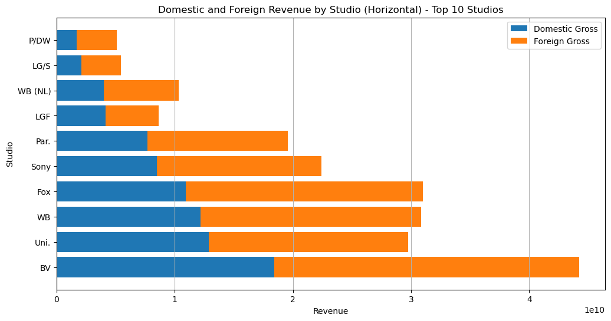
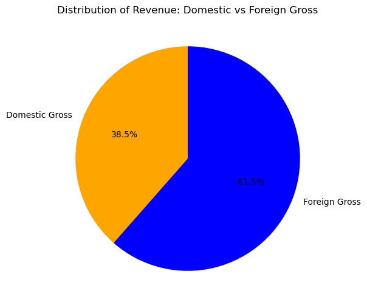
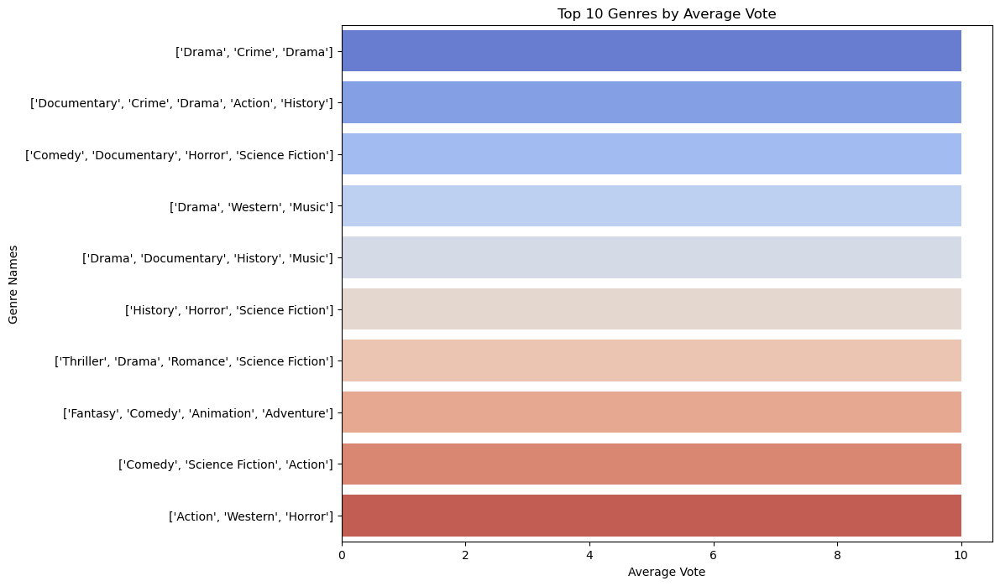

# Microsoft Movie Studio Business Analysis

## Overview

This project analysed what kind of films and genres were performing very well within the Box Office and which studios generated the most amount of revenue both in the domestic market and in the foreign market. To do this I used two datasets 'TMDB' and 'Bom.Movie_Gross' Dataset.
To show the patterns in the data, data visualisation was used and from it business recommendations could be made.
This recommedations are to be presented to Microsoft Studios to help build and improve a movie studio. 

## Business Understanding

Microsoft does not know anything about creating movies, yet they want to create a new movie studio.

There are many unknown factors associated with how to make a profit.

> + Which genre is perfoming well in the market?
> + Which studios are top performing to invest with them?
> + Is it better to concentrate on the local market or the foreign market or both and in what proportion?
    
Using the data provided and additional resources, I devised a plan to answer these questions about how best Microsoft can break into the movie studio market and ensure profitability.

## Data Analysis and Understanding

We are using movie datasets from 2 different datasets:

### TMDB
### Bom.Movies_Gross

The data includes information on movie genres, titles, runtime,  foreign & domestic box office gross, production studio name, and release dates.

With these datasets, we will search for insights in box office performance and user ratings compared to various factors like genre, personel, runtime and release time.

# Data Description

Some of the visualisations which were key to this project were:
### 1) Time series plot of revenue
The time series plot shows that throughout the years, studios have been making more revenue via foreign markets than domestic markets

### 2) Domestic and Foreign revenue by studio
The barchart shows the revenue distribution in the top 10 studios, where foreign gross is higher

### 3) Distribution of revenue
This piechart shows the distribution of revenue in the world market

### 4) Top genres
This barchart shows the top genres by viwers vote. Action, Drama, Science Fiction lead this category. With these genres, it is expected to generate a higher revenue.

## Conlusion

1. Genre Investment Strategy: Microsoft should focus on genres like Action, 
Science Fiction, Animation, Drama, and Comedy, as they have proven to 
be popular among viewers.

2. Global Audience: Foreign gross surpasses domestic gross, suggesting a 
significant global audience. Microsoft should tailor its content to appeal to 
diverse international markets.

3. Movie Release Strategy: The current number of movies released per year is 
relatively slow. Microsoft could explore automation strategies to increase 
the frequency of releases, keeping the content fresh and engaging.

4. Studio Performance: Certain studios outperform others. Microsoft should 
consider strategic investments in high-performing studios and explore ways 
to enhance the performance of struggling studios.
